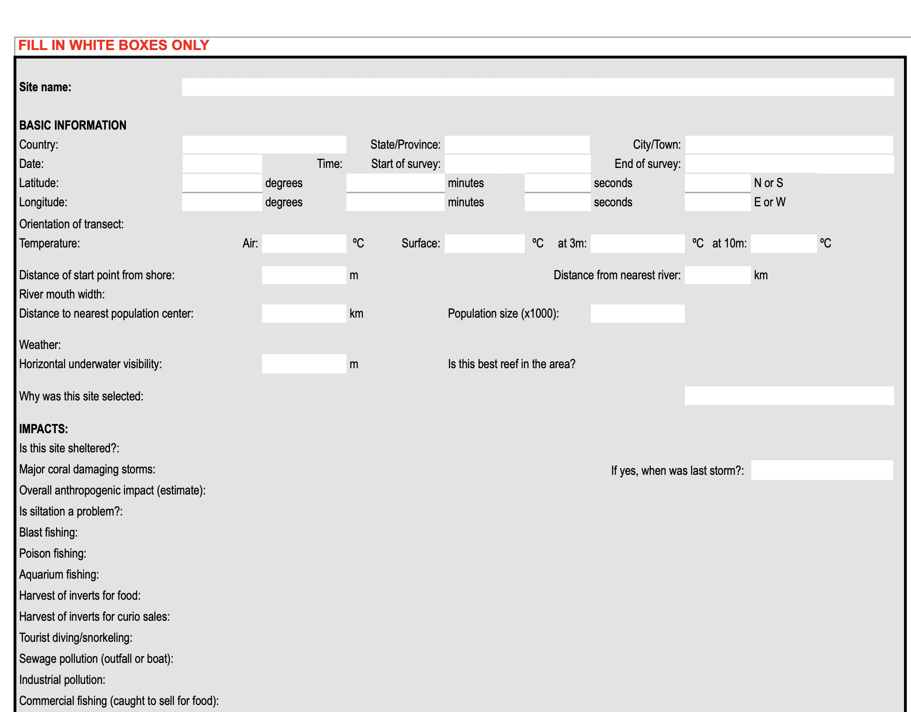
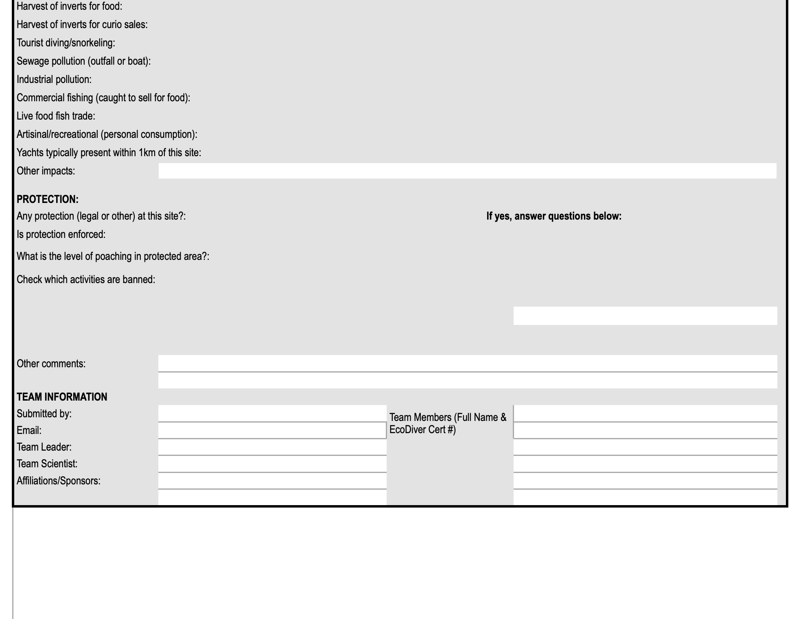
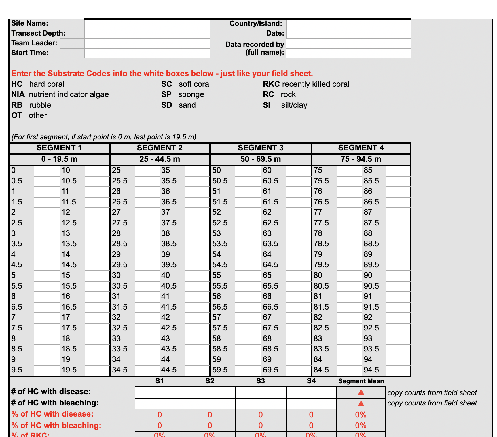
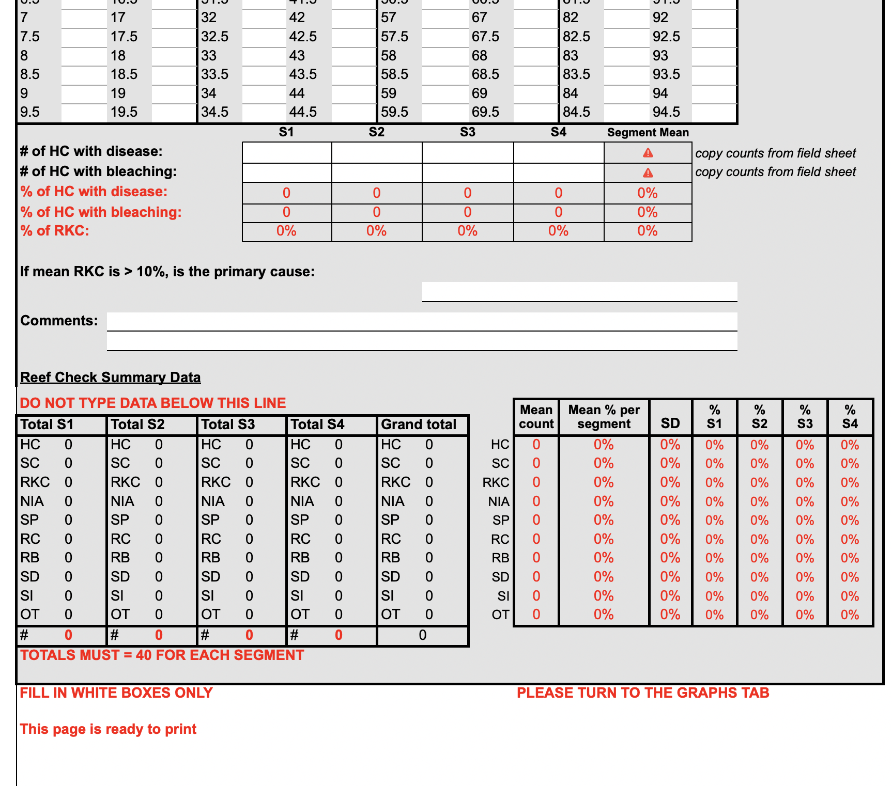
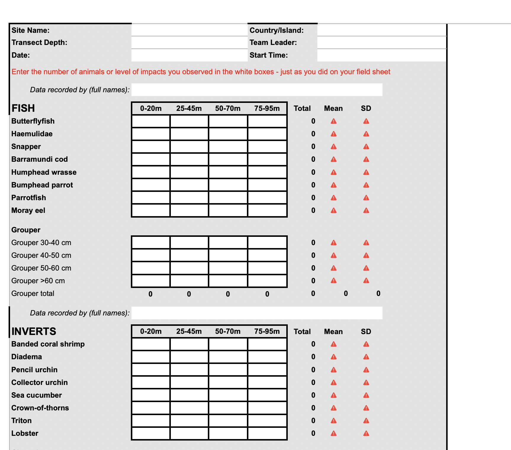
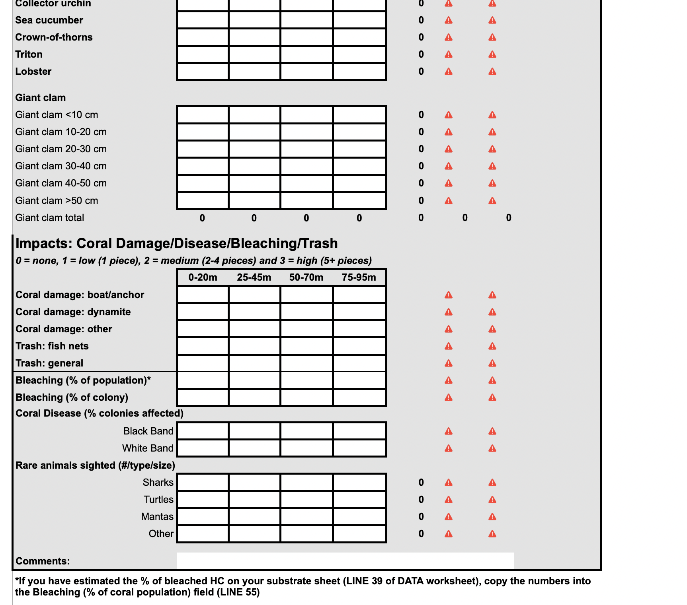

Reef Check / Coral Reef Program / Tropical Monitoring Instruction

Four types of data are recorded using standard Reef Check Data Forms (see Excel files below). The three transect surveys are made along the same 100m transect line.

Site Description. Anecdotal, observational, historical, location, and other socioeconomic data are recorded on the Site Description Form.
Fish belt transect. Four 5 m wide (centered on the transect line) by 20 m long segments are sampled for fish species typically targeted by fishermen, aquarium collectors, and others. Fish seen up to 5 m above the line are included. This is the first survey to be performed.
Invertebrate belt transect. The same four 5 m wide by 20 m long segments as used for the fish belt transect are sampled for invertebrate species typically targeted as food species or collected as curios. Reef impacts are also counted along this line.
Substrate line transect. The same transect line as the fish and invertebrate belt transects is used, but this time, points are sampled at each 0.5 m interval along the tape to determine the substrate types on the reef.
diagram of transect line
Reef Check surveys may be replicated as needed depending on the purpose of the monitoring. Three to five surveys on one reef will provide results useful for management.

For surveys to be accepted into Reef Check’s global database, all data collectors need to be certified Reef Check EcoDivers.

Data Sheets
Datasheets are available to download below. A hard copy of the Instruction Manual can be purchased through the Sea Store. Electronic copies of the manual and other instruction materials (PowerPoints, identification tests) are available through the EcoDiver program.

Please select and complete the appropriate datasheet for your region. There are specially formatted sheets to be used in the field. Your survey data can then be entered online to be reviewed by a Reef Check Administrator for submission into the global database. 

